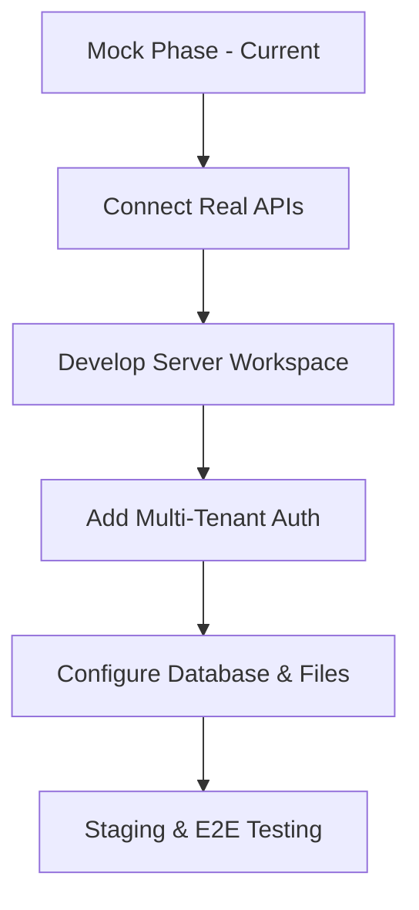

# VerifyX Platform — Development Progress & Worksheet

VerifyX is a modern, high-performance, AI-powered identity verification enterprise platform. This worksheet reviews the project's technical architecture, component breakdown, page structures, styling patterns, and next steps for the developmental phase.

---

## 1. Technical Stack & Architecture

The application is structured as a monorepo workspace containing the frontend client app (`client`) and backend service placeholder (`server`).

### Core Technologies
*   **Full-stack Framework:** [TanStack Start](https://tanstack.com/router/v1/docs/start/overview) (React + server-side rendering + file-based routing + query state management)
*   **Routing System:** [TanStack Router](https://tanstack.com/router) with auto-generated routing configuration (`routeTree.gen.ts`)
*   **State & Data Fetching:** `@tanstack/react-query`
*   **Styling System:** [Tailwind CSS v4](https://tailwindcss.com/) with native inline theme mapping and custom OkLCH color schemes
*   **Forms & Validation:** `react-hook-form` + `zod` for robust client-side validation schemas
*   **Visualizations:** `recharts` for dynamic verification trend graphics
*   **Visual Alerts & Alerts:** `sonner` for high-quality, reactive notifications
*   **UI Primitives:** Radix UI components (integrated in a shadcn-like structure)
*   **Icons:** `lucide-react`

---

## 2. Directory Layout & Key Files

### Workspace Directory Structure (`e:\VerifyX Platform`)
*   **`/package.json`**: Root monorepo configuration declaring the `client` and `server` workspaces.
*   **`/server/`**: A workspace folder designated for backend API microservices (currently has a package placeholder).
*   **`/client/`**: Main frontend and SSR web workspace.
    *   **`client/package.json`**: UI dependencies, scripts for development/build, and converters.
    *   **`client/vite.config.ts`**: Builds and bundles the project using `@tailwindcss/vite`, `react`, and `tanstackStart`.
    *   **`client/src/start.ts` & `client/src/server.ts`**: App bootstraps, routing loaders, and error-handling middlewares.
    *   **`client/src/styles.css`**: Core design definitions, including dark mode palette tokens (`oklch`) and custom animations (`glow-primary`, `animate-scan`, `animate-pulse-glow`, `animate-drift`).
    *   **`client/src/routes/`**: Handles page-level routes.
    *   **`client/src/features/`**: Area-specific logical modules.
    *   **`client/src/components/`**: Modular layout, common, and base UI primitives.

---

## 3. Implemented Routes & Page Overviews

The platform currently includes six defined routes inside `client/src/routes/`:

| Route File | Path | Status | Functionality |
| :--- | :--- | :--- | :--- |
| [`index.jsx`](file:///e:/VerifyX%20Platform/client/src/routes/index.jsx) | `/` | Complete | Landing page showing platform hero section, features list, interactive FAQ, client workflows, trust logos, and security certifications. |
| [`login.jsx`](file:///e:/VerifyX%20Platform/client/src/routes/login.jsx) | `/login` | Mocked | Sign-in interface. Validates credentials using Zod and simulates a 600ms network timeout before redirecting to the `/dashboard`. |
| [`register.jsx`](file:///e:/VerifyX%20Platform/client/src/routes/register.jsx) | `/register` | Mocked | Sign-up interface. Captures full name, email, and password, redirecting to the workspace dashboard on submit. |
| [`dashboard.jsx`](file:///e:/VerifyX%20Platform/client/src/routes/dashboard.jsx) | `/dashboard` | Complete | Main enterprise panel. Features real-time statistics cards, a Recharts area chart mapping daily verification trends, recent activity feeds, and a log table of all records. |
| [`verification.jsx`](file:///e:/VerifyX%20Platform/client/src/routes/verification.jsx) | `/verification` | Mocked | Multi-step wizard simulating identity verification stages: (1) Document upload -> (2) Automated OCR extraction with scanning overlay -> (3) Face-match verification -> (4) Comprehensive fraud and security report. |
| [`reports.jsx`](file:///e:/VerifyX%20Platform/client/src/routes/reports.jsx) | `/reports` | Complete | Filterable database panel. Allows searching verification records by ID/Name, status tags (Verified, Pending, Failed), and document types. Provides an export mechanism. |

---

## 4. Design & Theme System

The design uses a custom dark-enterprise look. Styling parameters are declared as native custom properties in [`client/src/styles.css`](file:///e:/VerifyX%20Platform/client/src/styles.css):

### Core Color Palette
*   **Background:** `oklch(0.16 0.012 160)` (#0B0F0D - deep dark obsidian)
*   **Surface / Cards:** `oklch(0.195 0.012 165)` & `oklch(0.215 0.012 162)` (#171F1C - enterprise green-gray tint)
*   **Primary Accent:** `oklch(0.85 0.19 138)` (#88E05A - bright green glow)
*   **Secondary Accent:** `oklch(0.78 0.11 175)` (#5AC8A8 - sleek teal highlight)
*   **Success:** `oklch(0.74 0.18 145)` (#22C55E)
*   **Destructive:** `oklch(0.65 0.22 25)` (#EF4444)

### Custom Animations & Utilities
*   `glow-primary`: Shadows cards with light green primary glow reflections.
*   `animate-scan`: An overlay scanning beam translating vertically to mimic OCR activity.
*   `animate-pulse-glow`: Radiating rings showing pass/fail status updates dynamically.
*   `animate-drift`: A moving grid pattern backdrop on headers/landing screens.

---

## 5. Summary of UI Component Libraries

VerifyX includes a complete collection of 46 Radix UI primitives configured within [`client/src/components/ui/`](file:///e:/VerifyX%20Platform/client/src/components/ui/):

*   **Context Control:** `dropdown-menu`, `context-menu`, `navigation-menu`, `sheet`, `popover`, `dialog`
*   **Forms & Input:** `input`, `textarea`, `select`, `checkbox`, `radio-group`, `switch`, `slider`, `input-otp`, `calendar`, `form`
*   **Structure & Layout:** `table`, `card`, `accordion`, `collapsible`, `resizable`, `sidebar`, `scroll-area`
*   **Visual Enhancers:** `badge`, `progress`, `avatar`, `carousel`, `chart`, `tooltip`, `skeleton`, `breadcrumb`

---

## 6. Next Steps & Development Roadmap

1.  **Back-End Microservices Development:**
    *   Initialize the back-end architecture in `/server/`.
    *   Build route controllers, controllers for OCR document parser integrations, and facial recognition/liveness endpoints.
2.  **State & API Synchronization:**
    *   Replace mock timeouts on `/login`, `/register`, and `/verification` with real query actions using `@tanstack/react-query`.
    *   Wire up webhooks for real-time status updates on long-running verifications (transitioning from pending states).
3.  **Real Document OCR & Biometrics Integration:**
    *   Integrate third-party OCR services (e.g., AWS Textract, Google Cloud Document AI) or local parsing logic.
    *   Integrate actual face-matching algorithms (checking uploaded document photo vs. captured selfie camera image).
4.  **Database & Authentication Setup:**
    *   Implement user registration, token/session persistence, and database schema mappings (PostgreSQL, MongoDB, or Prisma).
    *   Store uploaded identity document files securely with encrypted attachments (AES-256) and temporary access policies.
